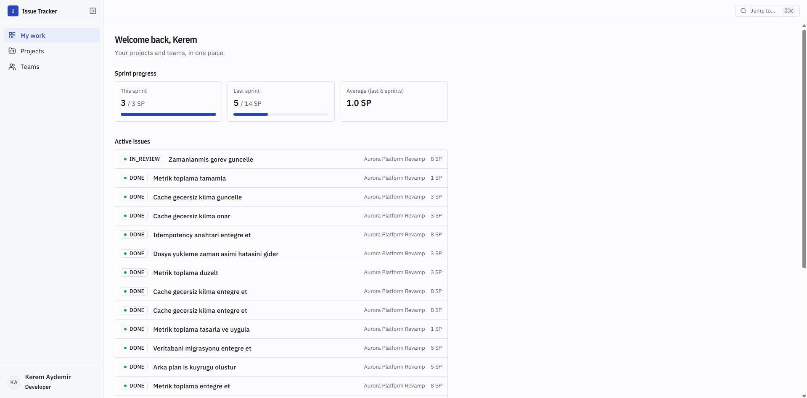
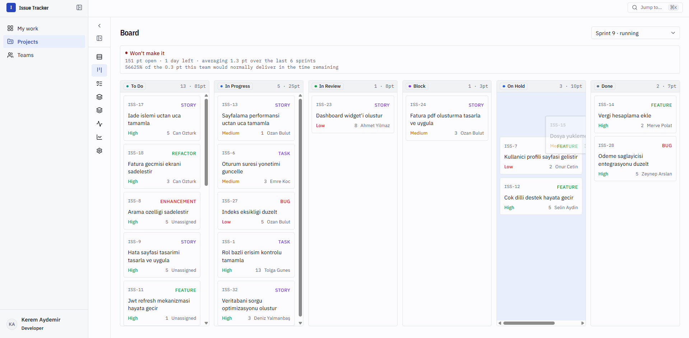
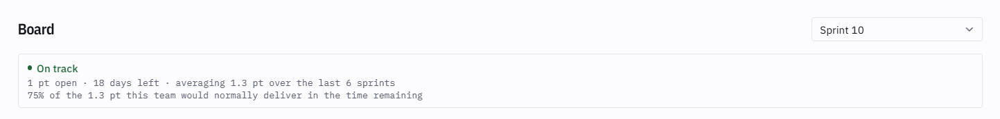
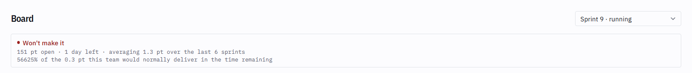
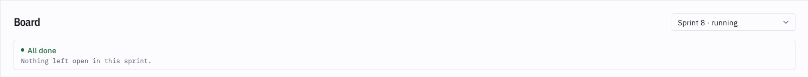
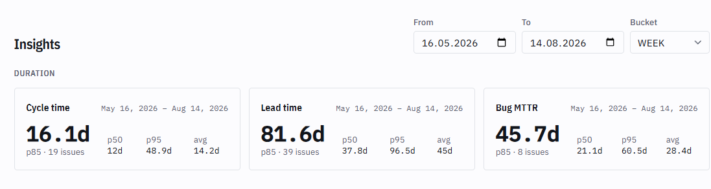
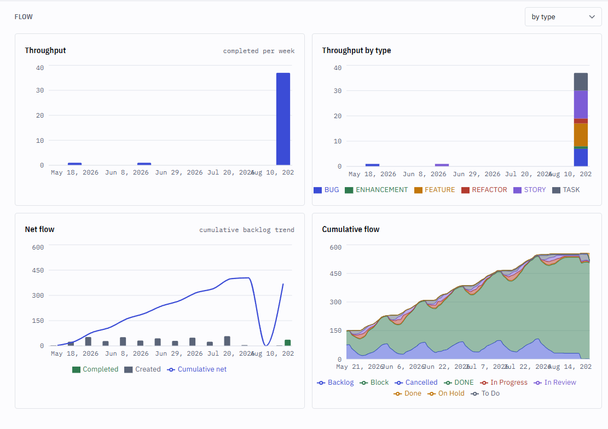
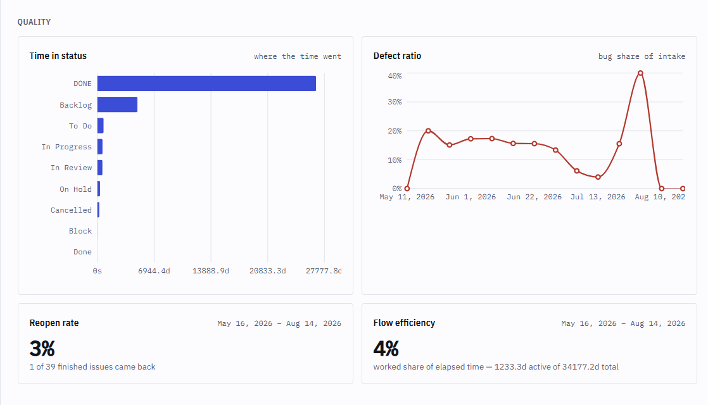

# Internal Issue Tracker

> A Jira-style internal issue tracking system: a **Modular Monolith** Spring Boot backend with a
> **Next.js** frontend.

<p align="left">
  
  
  
  
  
  
  
  
  
  
  
  
  
</p>

## About

Internal Issue Tracker is a project/sprint/issue tracking application intended for internal team use, similar in spirit
to Jira. It manages users, teams, projects, sprints, epics, issues, comments, avatars, and full activity history for
auditing and metrics purposes — end to end, with a Spring Boot API and the Next.js frontend built directly against it.

The backend is deliberately built as a **Modular Monolith** rather than microservices: a single deployable application
internally organized into independent, well-bounded modules (
via [Spring Modulith](https://spring.io/projects/spring-modulith)), each owning its own domain logic and enforcing
boundaries at compile/verification time. This gives the simplicity of a monolith (one deployment, one database, easy
local development) while keeping the codebase modular enough to split into separate services later if needed.
Cross-module events (activity logging, cache eviction, cleanup on delete) are externalized through **Kafka** via
Spring Modulith's event publication outbox, so a module never calls another module's internals directly — only reacts
to what happened.

## Screenshots


**My work** — every project and team the signed-in user touches, sprint progress, and active
issues assigned to them, in one place.



**Board** — one column per active issue status, sized to fit however many a project defines,
with drag-and-drop status changes.



Above the board, a sprint forecast projects completion from the team's actual delivery rate over
the last six sprints — not just "days left":

| On track | Won't make it | All done |
|---|---|---|
|  |  |  |

**Insights** — 14 agile metrics computed from the activity log rather than current state, so
they stay historical rather than a snapshot.





## Tech Stack

### Backend

| Layer                 | Technology                                  |
|-----------------------|----------------------------------------------|
| Language              | Java 25                                     |
| Framework             | Spring Boot 4.1.0                           |
| Architecture          | Spring Modulith 2.1.0 (Modular Monolith)    |
| Web                   | Spring Web MVC                              |
| Persistence           | Spring Data JPA + Hibernate                 |
| Database              | PostgreSQL 17                               |
| Migrations            | Flyway                                      |
| Security              | Spring Security, JWT                        |
| Event bus / outbox    | Spring Modulith Events + Apache Kafka       |
| Caching / rate limits | Redis + Lettuce, Bucket4j                   |
| Object storage        | MinIO (S3-compatible, via the AWS SDK)      |
| Malware scanning      | ClamAV                                      |
| Validation            | Spring Validation (Jakarta Bean Validation) |
| Build Tool            | Maven (via Maven Wrapper)                   |
| Boilerplate Reduction | Lombok                                      |
| Local Infrastructure  | Docker Compose                              |

### Frontend

| Layer            | Technology                              |
|-------------------|------------------------------------------|
| Framework         | Next.js 16 (App Router)                 |
| Language          | TypeScript 5                            |
| UI runtime        | React 19                                |
| Server state       | TanStack Query 5                        |
| Components        | shadcn/ui on Radix UI                   |
| Styling           | Tailwind CSS 4                          |
| Forms             | React Hook Form + Zod                   |
| Drag & drop       | dnd-kit (issue board)                   |
| Charts            | Recharts (metrics dashboards)           |

The frontend never calls the backend directly from the browser: `app/bff/[...path]/route.ts` is a
same-origin proxy that attaches the bearer token from an httpOnly cookie, so the token never reaches
client-side JavaScript.

## Database Schema

The database schema was designed with [dbdiagram.io](https://dbdiagram.io) and is version-controlled through Flyway
migrations under [`src/main/resources/db/migration`](./src/main/resources/db/migration) (`V1` through `V10`, covering
the initial schema, activity-log hardening, metric dimensions, field definitions replacing fixed enums, and user
avatars).

<!-- TODO: Replace with the exported dbdiagram.io schema image, e.g.: -->
<!--  -->

Core entities include: `users`, `teams`, `team_users`, `projects`, `project_teams`, `project_users`, `sprints`,
`epics`, `issues`, `comments`, `field_definitions` (per-project and global status/type/priority/unit vocabularies),
and per-entity activity logs (`issue_activities`, `sprint_activities`, `project_activities`) for tracking changes
over time.

## Project Structure

The backend follows the conventions of a Spring Modulith application, where each business capability lives in its own
top-level package (module) under the base package, with internal classes kept package-private and only intended APIs
exposed publicly. The frontend is a standard Next.js App Router project that consumes the backend exclusively through
its own BFF proxy route.

```
internal-issue-tracker/
├── src/
│   ├── main/
│   │   ├── java/com/ist/internal_issue_tracker/
│   │   │   ├── InternalIssueTrackerApplication.java   # Application entry point
│   │   │   ├── auth/                                   # Login, JWT issuance
│   │   │   ├── user/                                   # Users, roles, avatars
│   │   │   ├── team/                                   # Teams & membership
│   │   │   ├── project/                                # Projects, members, teams
│   │   │   ├── sprint/                                 # Sprints
│   │   │   ├── epic/                                   # Epics
│   │   │   ├── issue/                                  # Issues
│   │   │   ├── comment/                                # Comments
│   │   │   ├── fielddef/                                # Field definitions (status/type/priority/unit)
│   │   │   ├── activity/                                # Activity log + metrics
│   │   │   └── shared/                                  # Cross-cutting: security, ports, storage, ratelimit
│   │   └── resources/
│   │       ├── application.properties                 # Application configuration
│   │       ├── db/migration/                           # Flyway SQL migrations (versioned schema)
│   │       ├── static/                                 # Static web assets
│   │       └── templates/                               # Server-side templates
│   └── test/
│       └── java/com/ist/internal_issue_tracker/        # Tests (unit, module, integration)
├── frontend/                                             # Next.js 16 App Router frontend
│   ├── app/                                              # Routes: (app), (auth), api/session, bff proxy
│   ├── components/                                       # board, backlog, sprint, issue, settings, shell, ui, ...
│   ├── lib/                                               # api client, hooks, auth, project/sprint context
│   └── public/
├── docs/API.md                                           # Full backend API reference
├── compose.yaml                                          # Local Postgres, Redis, Kafka, MinIO, ClamAV
├── pom.xml                                               # Maven project & dependency definitions
├── .env.example                                          # Example backend environment variables
└── mvnw / mvnw.cmd                                       # Maven Wrapper
```

Each module is expected to be verified for boundary violations using Spring Modulith's testing support (
`ApplicationModules.verify()`, run as `ModularityTests`) as the codebase grows.

## Getting Started

### Prerequisites

- Java 25 (JDK)
- Node.js 20+ and npm (for the frontend)
- Docker & Docker Compose (for local Postgres, Redis, Kafka, MinIO, and ClamAV)
- Maven Wrapper is included, so a local Maven install is not required

### 1. Clone the repository

```bash
git clone https://github.com/denizylmnbs/internal-issue-tracker.git
cd internal-issue-tracker
```

### 2. Configure environment variables

Copy the example environment file and adjust the values as needed:

```bash
cp .env.example .env
```

`.env.example` documents every variable inline; the essentials are database, Redis and Kafka
connection settings, the JWT secret/expirations, CORS origins for the frontend, and MinIO/ClamAV
settings for avatar storage and malware scanning (all optional in local dev — they fall back to
sane defaults that match `compose.yaml`).

### 3. Start local infrastructure

```bash
docker compose up -d
```

This starts Postgres 17, Redis, Kafka, MinIO (S3-compatible object storage), and ClamAV (malware
scanning for uploads) as named containers with persistent volumes.

### 4. Run the backend

```bash
./mvnw spring-boot:run
```

On startup, Flyway automatically applies all pending migrations under `src/main/resources/db/migration` against the
configured database. The API listens on `http://localhost:8080` by default.

### 5. Run the backend tests

```bash
./mvnw test
```

### 6. Run the frontend

```bash
cd frontend
npm install
cp .env.example .env.local   # points the BFF proxy at the backend and mirrors its JWT expirations
npm run dev
```

Open [http://localhost:3000](http://localhost:3000) with your browser. The dev server proxies every
API call through `app/bff/[...path]/route.ts` to the backend at `API_BASE_URL` (defaults to
`http://localhost:8080`).

Other frontend scripts:

```bash
npm run build   # production build
npm run start   # serve the production build
npm run lint    # ESLint
```

## API Documentation

**→ [`docs/API.md`](./docs/API.md)** — the complete reference for all 93 endpoints across 18 controllers: request and
response shapes, query parameters, authorization rules per route, every error code, and the
behavioural rules a client has to know (full-replacement `PUT`s, sparse metric series, the
`/members` vs `/participants` distinction, and so on).

## Project Status

✅ **Complete.** Every domain module is implemented, wired through the event-driven activity log, and covered by the
authorization model below; the Next.js frontend consumes the full API.

What's in place:

- [x] Project scaffolding (Spring Boot + Maven) and Docker Compose infrastructure (Postgres, Redis, Kafka, MinIO, ClamAV)
- [x] Database schema via Flyway migrations, `V1` through `V10`
- [x] Module boundaries enforced at build time (`ModularityTests`)
- [x] Shared exception hierarchy, global exception handler, single response envelope, paged responses
- [x] JWT authentication (`POST /api/auth/login`), stateless security filter chain
- [x] Role hierarchy (`ADMIN → EDITOR → DEVELOPER → USER`) plus project-scoped authorization
- [x] `user` module — CRUD, password management, role changes with lockout guards, avatar upload/removal
- [x] `team` module — teams, membership, leadership
- [x] `project` module — projects, direct members, assigned teams, participants, leadership
- [x] `sprint` module — sprints with one-running-sprint enforcement and commitment snapshots
- [x] `epic` module — epics and their lifecycle
- [x] `issue` module — issues, status, dual (user + team) assignment, filtering, board grouping
- [x] `comment` module — comments with author-scoped editing
- [x] `fielddef` module — per-project and global status/type/priority/unit definitions, replacing fixed enums, with
  usage checks and reassignment before a value can be deleted
- [x] `activity` module — issue / sprint / project audit logs, externalized to Kafka via Spring Modulith events
- [x] `activity.metrics` — 14 agile metrics computed from the log
- [x] Redis-backed caching (metrics, auth) and rate limiting (Bucket4j), including a stricter bucket for uploads
- [x] Avatar upload: MinIO object storage, ClamAV malware scanning, image normalization
- [x] API documentation ([`docs/API.md`](./docs/API.md))
- [x] CORS for the browser frontend (`CORS_ALLOWED_ORIGINS`, defaults to `http://localhost:3000`)
- [x] `GET /api/auth/me` — the authenticated caller's own record, role included
- [x] Next.js 16 frontend — auth, projects, board, backlog, sprints, epics, issues, comments, activity feed, metrics
  dashboards, admin user/field-definition management, collapsible navigation

## Roles & Permissions

Authorization is built on **two independent axes**. Keeping them separate matters: a global role answers *"is this
kind of user allowed to do this kind of thing?"*, while project membership answers *"is this user allowed to do it
**here**?"*. Both checks apply.

### 1. Global role (`users.role`)

A single enum column on the user, replacing the current `is_admin` boolean.

| Role        | Intent                | Capabilities                                                                          |
|-------------|-----------------------|---------------------------------------------------------------------------------------|
| `ADMIN`     | System administrator  | Full access to every endpoint; manages users and roles                                 |
| `EDITOR`    | Delivery manager      | Creates and deletes teams and projects; may act on any project regardless of leadership |
| `DEVELOPER` | Regular contributor   | Joins teams, creates issues, takes/receives assignments, comments, moves issues        |
| `USER`      | Read-only stakeholder | Views only; cannot be added to a team or a project at all                              |

Roles are hierarchical — `ADMIN` implies `EDITOR` implies `DEVELOPER` implies `USER` — so a rule written as
`hasRole('DEVELOPER')` also admits editors and admins, and each endpoint only needs to declare its *minimum* role.

Note that `DEVELOPER` is the **minimum role for membership**: adding a plain `USER` to a team or a project is
rejected with `403 USER_ROLE_NOT_ENOUGH`.

### 2. Project-scoped access (`projects.leader_id`, `project_users`, `project_teams`)

"Project leader" is deliberately **not** a global role: it is a relationship stored as data. The same person can lead
one project while being an ordinary member of another. Fine-grained checks ("is the caller a participant of this
project?", "is the caller its leader?") resolve against these tables, exposed to the security layer through the
`ProjectLookup` and `TeamLookup` ports in `shared.port` — the same pattern already used by `AuthenticatedUserLookup`.

Three rules are built on top of those ports in `SecurityConfig`:

| Rule | Admits |
|------|--------|
| `editorOrTeamLeader` | `EDITOR`+, or the leader of *this* team |
| `editorOrProjectLeader` | `EDITOR`+, or the leader of *this* project — planning artifacts (sprints, epics) and destructive issue operations |
| `editorLeaderOrParticipant` | the above, plus anyone actually working on the project — a direct member **or** a member of an assigned team |

Participation is what the issue and comment routes run on: refusing a developer the right to file or move their own
work would make the tracker unusable. It also gates the activity feeds and the metrics — the only reads restricted
beyond being logged in, since a team that cannot see its own flow cannot improve it.

### Design notes

- The role is **not** carried as a JWT claim. It is resolved from the database on every request (see
  `UserAuthenticatedUserLookup`), so a role change or deactivation takes effect immediately rather than at token
  expiry.
- Authorization rules stay centralized in `SecurityConfig` rather than scattered across `@PreAuthorize` annotations.
- Self-registration always creates a `USER`; the create/update DTOs never accept a role field. Promotion is an
  admin-only operation.
- Role changes are guarded against lockout by a single rule: the caller must **strictly outrank both** the target's
  current role and the requested new role. An admin therefore cannot change their own role, cannot demote another
  admin, and cannot promote anyone to admin.
- Nested routes name the project path variable `id` rather than `projectId`, because the authorization managers read
  it literally out of `RequestAuthorizationContext#getVariables()`. That naming is what lets one rule cover
  `/api/projects/{id}/issues/{issueId}/comments/{commentId}` without a port of its own.

## Endpoints

All 93 endpoints are documented in **[`docs/API.md`](./docs/API.md)**. Summary:

| Area | Base path | Count |
|------|-----------|-------|
| Auth | `/api/auth` | 2 |
| Users (incl. teams, projects, avatar) | `/api/users` | 12 |
| Teams & membership | `/api/teams` | 10 |
| Projects | `/api/projects` | 8 |
| Project members | `/api/projects/{id}/members`, `/participants` | 4 |
| Project teams | `/api/projects/{id}/teams` | 3 |
| Sprints | `/api/projects/{id}/sprints` | 6 |
| Epics | `/api/projects/{id}/epics` | 6 |
| Issues | `/api/projects/{id}/issues` | 8 |
| Comments | `/api/projects/{id}/issues/{issueId}/comments` | 5 |
| Activity log | `/api/projects/{id}/**/activities` | 3 |
| Metrics | `/api/projects/{id}/metrics` | 14 |
| Field definitions | `/api/projects/{id}/field-definitions`, `/api/field-definitions` | 12 |

## Metrics

The `activity.metrics` module computes 14 agile metrics from the activity log rather than from the issues' current
state, which is what makes them historical rather than a snapshot: **cycle time**, **lead time**, **bug MTTR**,
**throughput** (and a breakdown by type or priority), **time in status**, **flow efficiency**, **reopen rate**,
**net flow**, **defect ratio**, **WIP** with an aging list, **velocity**, **burndown**, and a **cumulative flow
diagram**.

They are project-level aggregates with no per-person breakdown, deliberately: a metric that becomes an individual
performance measure stops describing the work and starts describing how people respond to being measured — which
would corrupt the log it is all computed from.

## License

This project is licensed under the [MIT License](./LICENSE).
